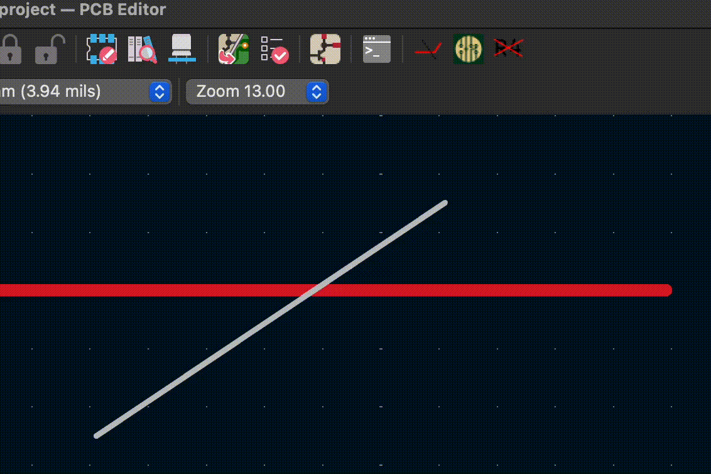
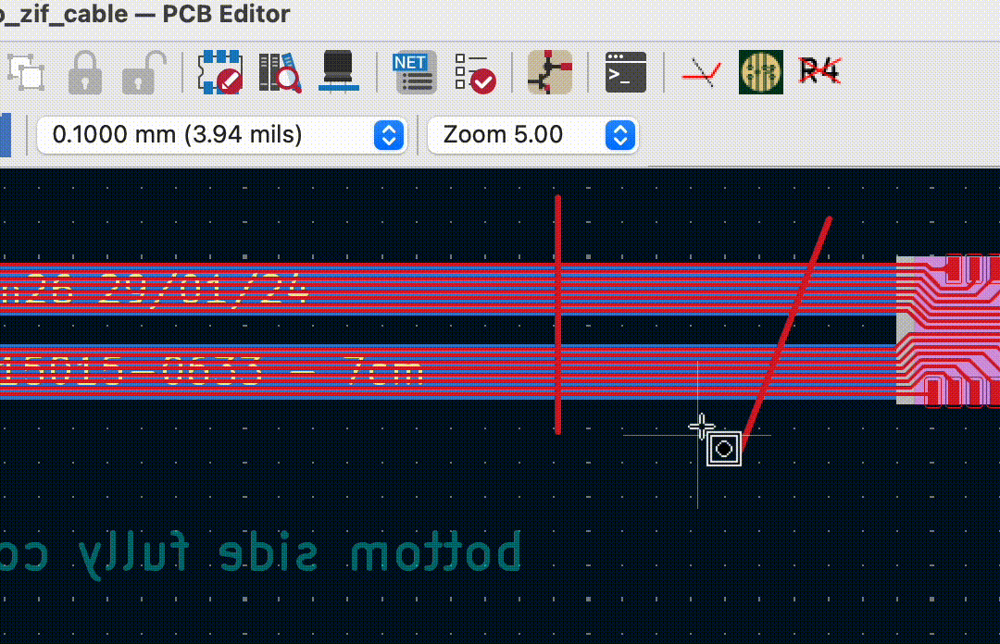

# CutTracksAtLine KiCad plugin
"CutTracksAtLine" is a KiCad pcbnew plugin that cuts all selected tracks at their intersection with line objects within the same selection. The plugin is layer agnostic, i.e. tracks from multiple layers can be cut simultaneously with lines placed on any layer.

I wrote this plugin when I wanted to change the length of a flex cable / flex PCB but was unable to do so without doing a major redesign.

## Usage
1. Select all the tracks you want to cut, along with the line objects that intersect the tracks.
2. Press the  button in the toolbar.

## Installation
The plugin is part of the official KiCad repository of the KiCad Plugin and Content Manager (PCM). Alternatively, you can download the .zip file from the github [releases](https://github.com/tnaegele/KiCADCutTracksAtLine/releases) page and install it manually using the PCM.

## Credits
I used the really useful [KiCADBulkHideSilkscreenDesignators](https://github.com/ulikoehler/KiCADBulkHideSilkscreenDesignators) plugin by Uli Köhler as a template for this plugin. The line_intersection() function was generated with heavy use of GitHub's Copilot, so please let me know if you see your code in there.
