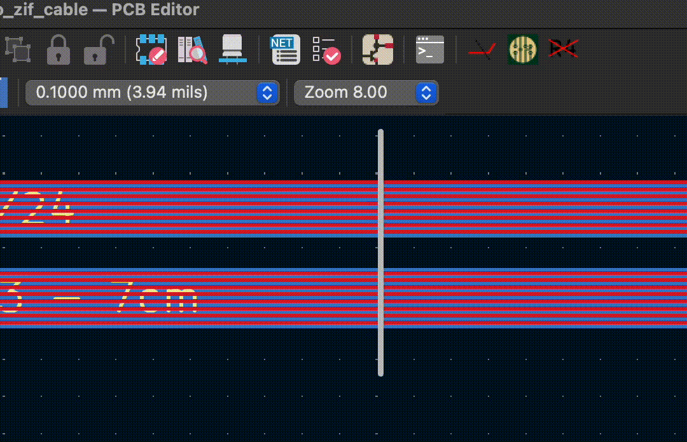

# CutTracksAtLine KiCAD plugin
"CutTracksAtLine" is a KiCAD pcbnew plugin that cuts all selected tracks at their intersection with a line object within the same selection. The plugin is layer agnostic, i.e. tracks from multiple layers can be cut simultaneously using a line placed on any layer.

I wrote this plugin when I wanted to change the length of a flex cable / PCB but was unable to do so without doing a major redesign.

## Usage
1. Select all tracks you want to cut and a single line object which intersects the tracks.
2. Press the  button in the toolbar

## Credits
I used the really useful [KiCADBulkHideSilkscreenDesignators](https://github.com/ulikoehler/KiCADBulkHideSilkscreenDesignators) plugin by Uli Köhler as a template for this plugin. The line_intersection() function was generated with heavy use of GitHub's Copilot, so please let me know if you see your code in there.
